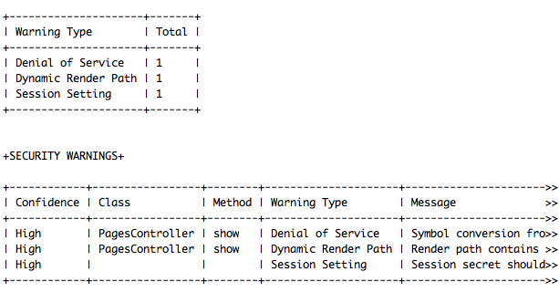

# #5 vienna.rb - 18.07.2013 #

### The testing and continuous deployment edition

Sponsored by codeship.io

# The Talks

- Andreas Tiefenthaler - Gem of the month

 - Tony Bangratz - Making your tests faster

 - Clemens Helm - Continuous deployment

 - Markus Prinz - Vagrant

 - Aaron Cruz - Vagrant Demo

# The Gem: Brakeman

 - Brakeman is a security scanner for Ruby on Rails applications.

 - It statically analyzes Rails application code.

 - Runs nicely with Jenkins and other CI platforms.

# 2.1.0 Released on 17.07.2013
So what is new?

 - brakeman-min: 4 instead of 13 required gems.

 - Support for ignoring warnings.

 - Mass assignment to dangerous attributes included in attr_accessible.

 - http_basic_authenticate_with - checks for hard coded passwords.

 - a lot more: see http://brakemanscanner.org/blog/2013/07/17/brakeman-2-dot-1-0-released/

# How to use it? (1/2)

 - gem install brakeman

 - gem "brakeman", :require => false

 - in your RAILS_ROOT run: brakeman

# How to use it? (2/2)

- -o creates text, html, tabs(used for Jenkins), csv

 - -s supersafe_method suppresses warnings.

 - -w{1,2,3} sets the confidence level. (1 Weak, 2 Medium, 3 High)

 - -x DefaultRoutes specifies which tests to run.

 - use it as a library: Brakeman.run :app_path => "my/app"

!SLIDE

## Thank you!

 - Help and advisory but not an insurance that your code is safe.

 - [http://brakemanscanner.org/]([http://brakemanscanner.org/)

 - @pxlpnk
